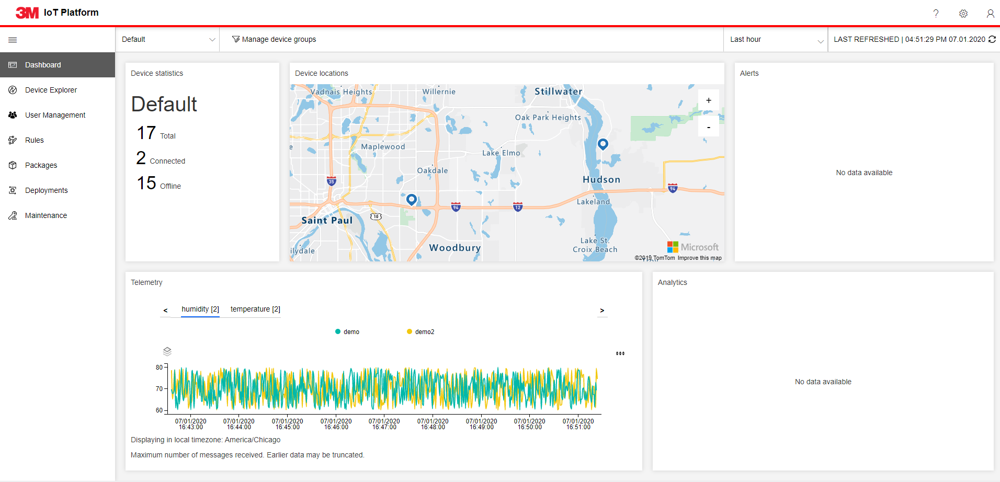
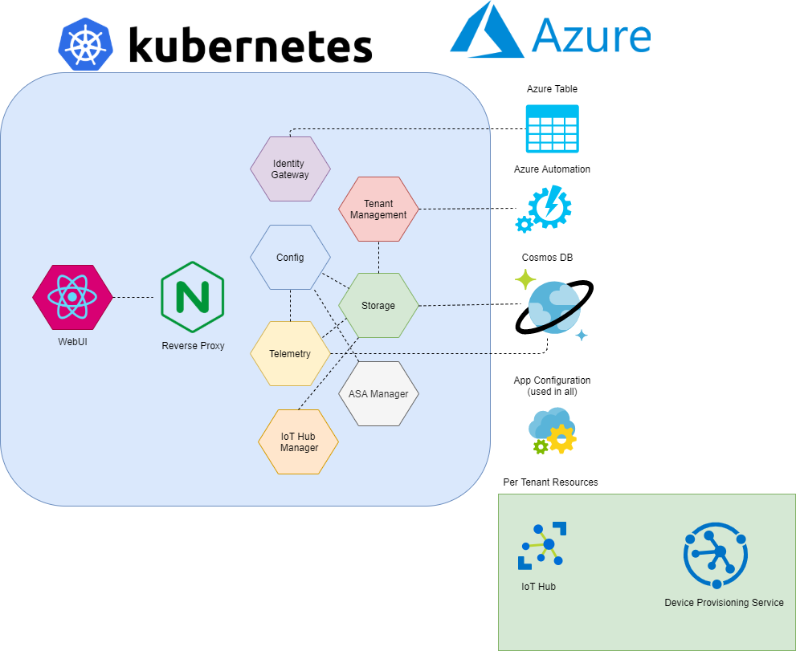

# Overview

3M's IoT Platform helps you get better visibility into your devices, assets, and
sensors wherever they happen to be located. You can collect and analyze real-time
device data using a remote monitoring solution that triggers automatic alerts and
actions — from remote diagnostics to maintenance requests. You can also command and
control your devices.

# Architecture Overview

# Development
See [here](../docs/DEVELOPMENT.md) for detailed instructions on getting setup for development.

# Attribution
Microsoft graciously provided an IoT Accelerator that we based this code upon:
https://github.com/Azure/azure-iot-pcs-remote-monitoring-dotnet